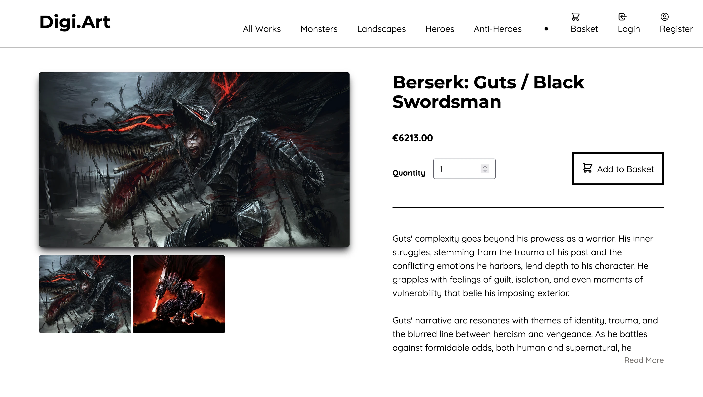
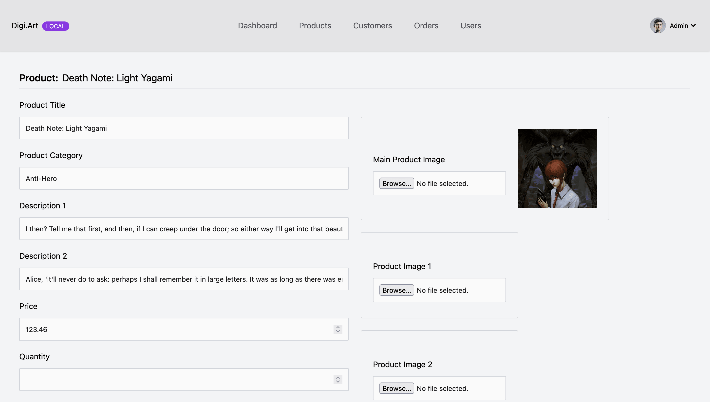

# Simple Laravel E-Commerce

This is a laravel project for an e-commerce website/app that allows online sellers to sell, categorize and take payment for the sale of goods online.

The project aims to build a website on the Laravel Framework for improved security and speedy development. It allows user's to register an account and log in to review their orders. Additionally, the website allows the administrator to gather the latest data such as recent purchases and on going orders through an the admin panel.

## Table of Contents

-   [Getting Started](#getting-started)
    -   [Running the backend/admin panel locally](#running-the-backendadmin-panel-locally)
-   [Demo Images](#demo-images)
-   [Frontend Dependencies](#frontend-dependencies)
    -   [Core Technologies](#core-technologies)
    -   [UI/Styling](#uistyling)
    -   [Development Tools](#development-tools)
    -   [Data Handling & Utilities](#data-handling--utilities)
-   [Backend Dependencies](#backend-dependencies)
    -   [PHP Core Requirements](#php-core-requirements)
    -   [Database & ORM](#database--orm)
    -   [Payment Processing](#payment-processing)
    -   [API & HTTP](#api--http)
-   [Future Improvements](#future-improvements)
-   [Media](#media)

## Getting Started

To begin, follow these steps:

1. Set up your `.env` file. Navigate to the `backend/` folder and configure your `.env` file there too. Follow the `.env.example` file for sample file contents.

2. Go to `backend/` and copy the `.env.example` - from the root:

```php
cp backend/.env.example backend/.env
```

3. In your `.env` file ensure you have outlined your **category plural names** and **category singular names**. They must be somewhat similar as in the `.env` file.

4. You'll need to configure your mailer settings in the `.env` file:

```php
MAIL_MAILER=smtp
MAIL_HOST=mailhog
MAIL_PORT=1025
MAIL_USERNAME=null
MAIL_PASSWORD=null
MAIL_ENCRYPTION=null
MAIL_FROM_ADDRESS="hello@example.com"
MAIL_FROM_NAME="${APP_NAME}"
```

5. Configure your strip API details in the `.env`

6. Ensure you assign a database for your project. If you don't have a similar database you'll need to:

    - Run database migrations: `php artisan migrate`. If you don't have a database, it will prompt if you'd like to create one named in your `.env` file. Type `yes`.
    - Run `php artisan db:seed`

7. In your terminal, go to the project root directory and run:

    ```bash
    npm install && composer install
    ```

8. Next, navigate to the `backend/` folder and run:

    ```bash
    npm install --legacy-peer-deps
    ```

9. Return to the project root directory and execute the following commands in your terminal:
    ```bash
    php artisan serve
    npm run dev
    ```

### Running the backend/admin panel locally

Once you have setup your database, seeded your database and established your `.env` files. To access the backend admin, follow these steps:

1. From the project root directory, navigate to the `backend/` folder.

2. Run:

    ```bash
    npm run dev
    ```

3. Go to your backend URL - enter your admin login details:

```php
admin@example.com
admin123
```

## Demo Images

**Overview:**


&nbsp;

**Product Individual:**


&nbsp;

**Product Modal:**


&nbsp;

**Product Checkout:**


&nbsp;

**Admin Dashboard:**


&nbsp;

**Admin Panel Orders:**


&nbsp;

**Admin Panel Product Edit:**


## Frontend Dependencies

### Core Technologies

-   Laravel (PHP Framework v9.19+)
-   Alpine.js (v3.12.0) with Collapse and Persist plugins
-   Vue.js (v3.2.25) with Vue Router (v4.0.13) and Vuex (v4.0.2)

### UI/Styling

-   Tailwind CSS (v3.1.0)
-   HeadlessUI/Vue (v1.6.6)
-   Heroicons/Vue (v1.0.6)

### Development Tools

-   Vite (v4.0.0)
-   PostCSS (v8.4.6)
-   Autoprefixer (v10.4.2)
-   Laravel Vite Plugin (v0.7.2)

### Data Handling & Utilities

-   Axios (v1.1.2)
-   Lodash (v4.17.19)
-   Chart.js (v4.4.1) with Vue-ChartJS (v5.3.0)

## Backend Dependencies

### PHP Core Requirements

-   PHP (v8.1+)
-   Laravel Framework (v9.19+)
-   Laravel Sanctum (v3.0+)
-   Laravel Tinker (v2.7+)
-   Laravel Breeze (v1.19+)
-   Laravel Sail (v1.0.1+)
-   Laravel Pint (v1.0+)
-   PHPUnit (v9.5.10+)
-   Faker PHP (v1.9.1+)
-   Mockery (v1.4.4+)
-   Collision (v6.1+)
-   Laravel Ignition (v1.0+)

### Database & ORM

-   Doctrine DBAL (v3.6+)
-   Spatie Laravel Sluggable (v3.4+)

### Payment Processing

-   Stripe PHP SDK (v9.6+)

### API & HTTP

-   GuzzleHTTP (v7.2+)

## Future Improvements

-   Improve/Update Laravel and Tailwind versions and every other dependency.
-   Create a reset password functionality for admin users
-   Create a better categorization feature for products
-   Develop a better solution for multiple images assigned to a product
-   Allow for comments and reviews under products
-   Develop admin profile editing functionality/feature
-   WYSIWYG editor for products

## Media

-   I got most of my media from Google images
-   I do not own any of the media
-   Media used from the readme doc is for educational purposes only
